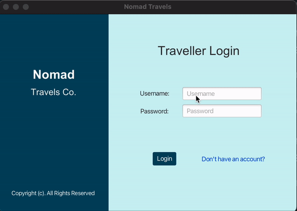

# nomads

Camille L., Mustafa S., Nathaniel C.

## Mission Statement:

Unleash your inner adventurer and explore unforgettable experiences at your fingertips.

## User Documentation :

1. Will run on Windows, Mac, and Linux.2. Clone the repository on your terminal:

```
git clone git@github.com:ssameen/nomads.git\
```
2. Install the jdbc server in your dependencies in Project Structure using the jar file given in the directory 'lib'. 
Open local mysql server with port 8889.
Then run the following command:
```
CREATE DATABASE NOMADS:
USE NOMADS:
```

3. Go to the directory sqlScripts, and run both of the scripts to create
tables 'user' and 'preferences'. From the same directory run the insertIntoPreferencesScript
to populate your preferences table with the necessary information.

4. Using an SQL Table Import Wizard (MySQLWorkbench is a useful tool for this) import the 'countries.csv' file from
the 'docs' directory. Change the names of the columns to fit the SQL Queries (Columns are
'Country', 'Area', 'Population', 'Region').

5. Go to src/main/java/nomads and run this compile and run command in your terminal:

```
javac MainApp.java
java MainApp
```

6. Interact with the application in your terminal.

## Problem:

Digital softwares and internet accessibility have changed the horizons of travel possibilities. Any wanderlust traveler
curious about other places, peoples, and cultures can search for locations, flights, and accommodations using today's
available software. While it may seem as though booking travel is as accessible, quick, and navigatable as can be, that
is not the case. Today's current travel software presents challenges to travelers seeking viable travel opportunities
dependent on visa and origin locations. Currently, aviation opportunities and travel sites separate travel regulation
information and transportation or destination information. A traveler in the current market can research destinations
for travel, visa regulations, and aviation opportunities; however, the process is complicated, layered, and
time-consuming. Motivated travelers will continue to jump through the required hoops to be able to travel, despite the
lack of cohesive travel planning and organization software in the market.

## Demo Run



## Logo:


